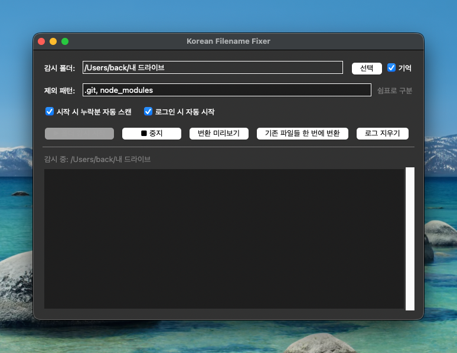

# Korean Filename Fixer

macOS에서 생성된 한글 파일명의 유니코드 정규화 형식을 **NFD → NFC**로 자동 변환하는 GUI 앱입니다.

## 스크린샷



## 배경

macOS는 한글 파일명을 **NFD(Normalization Form D)** 방식으로 저장합니다.
Windows나 Linux는 **NFC(Normalization Form C)** 를 사용하기 때문에, macOS에서 만든 파일을 다른 OS로 옮기면 파일명이 깨지거나 인식되지 않는 문제가 발생합니다.
이 앱은 해당 문제를 자동으로 해결합니다.

## 기능

| 기능 | 설명 |
|------|------|
| **한 번 변환** | 선택한 폴더 전체를 즉시 일괄 변환 |
| **변환 미리보기** | 실제 변경 없이 변환 예정 이름과 충돌 가능성을 먼저 확인 |
| **시작 시 자동 스캔** | 앱이 꺼져 있던 동안 놓친 NFD 파일을 시작 시 한 번 정리 |
| **로그인 시 자동 시작** | macOS와 Windows에서 로그인 후 앱을 자동으로 실행해 감시를 이어감 |
| **실시간 감시** | 폴더를 감시하다가 NFD 파일이 생성/이동되면 자동 변환 |
| **재귀 처리** | 하위 폴더까지 모두 탐색, 깊은 경로부터 처리해 rename 충돌 방지 |
| **제외 패턴** | `.git`, `node_modules`, `venv` 등 기본 디렉터리를 쉼표 구분 패턴으로 제외 |
| **변환 로그** | 변환 성공·오류·건너뜀 결과를 컬러 로그로 표시 |
| **macOS 메뉴바 상주** | X 버튼으로 닫아도 macOS 메뉴바에 상주하며 감시 유지 |

## 프로젝트 구조

```
korean-filename-fixer/
├── main.py          # 진입점 — GUI 실행
├── gui.py           # tkinter 기반 GUI (App 클래스)
├── converter.py     # NFD→NFC 변환 로직 (ConvertResult, convert_folder 등)
├── watcher.py       # watchdog 기반 실시간 폴더 감시 (FolderWatcher)
├── build.sh         # PyInstaller 빌드 스크립트 (macOS onedir / Windows onedir)
└── requirements.txt # 의존성 목록
```

## 설치 및 실행

### 요구사항

- Python 3.12
- macOS (NFD 파일명 문제가 발생하는 환경)

### 의존성 설치

```bash
pip install -r requirements.txt
```

`pyobjc-framework-Cocoa` 는 macOS에서만 설치되며, 메뉴바 트레이 기능에 사용됩니다.

### 실행

```bash
python main.py
```

## macOS 앱(.app)으로 빌드

```bash
bash build.sh
```

빌드가 완료되면 다음 파일들이 생성됩니다.

```
dist/KoreanFilenameFixer          # 실행 파일
dist/KoreanFilenameFixer.app      # 앱 번들
dist/KoreanFilenameFixer.app.zip  # 배포용 zip (codesign 기준)
```

GitHub Release에서는 보조적으로 Windows `.exe` 아티팩트도 함께 생성합니다. 다만 이 프로젝트의 핵심 문제와 메뉴바 UX는 macOS 기준으로 설계되어 있습니다.

> **첫 실행 시 Gatekeeper 경고가 뜨는 경우:**
> 시스템 설정 → 개인 정보 보호 및 보안 → '확인 없이 열기' 클릭
> 또는 터미널에서: `xattr -cr dist/KoreanFilenameFixer.app`

## 사용 방법

1. 앱 실행 후 **[선택]** 버튼으로 대상 폴더를 지정합니다.
2. 필요하면 **제외 패턴** 칸에 `.git, node_modules, venv` 처럼 쉼표로 구분한 디렉터리명을 입력합니다.
3. 필요하면 **시작 시 누락분 자동 스캔** 옵션을 켜 두면, 저장된 폴더를 앱 시작 직후 한 번 정리한 뒤 감시를 시작합니다.
4. 필요하면 **로그인 시 자동 시작** 옵션으로 로그인 후 앱이 자동으로 열리게 설정합니다. macOS는 `.app`, Windows는 `.exe` 배포 실행에서 지원합니다.
5. **[변환 미리보기]** — 실제 변경 없이 변환 예정 목록과 충돌 가능성을 확인합니다.
6. **[기존 파일들 한 번에 변환]** — 폴더 전체를 즉시 스캔하여 NFD 파일명을 NFC로 변환합니다.
7. **[▶ 폴더 감시 시작]** — 백그라운드에서 폴더를 감시하며, 새 파일이 추가될 때마다 자동 변환합니다.
8. **[■ 중지]** — 실시간 감시를 종료합니다.
9. 창의 **X 버튼**을 누르면 종료가 아닌 메뉴바로 숨겨집니다. 완전 종료는 메뉴바 아이콘 → **종료** 를 사용합니다.

## 의존성

| 패키지 | 용도 |
|--------|------|
| `watchdog >= 4.0.0` | 실시간 파일 시스템 이벤트 감시 |
| `pyobjc-framework-Cocoa >= 10.0` | macOS 메뉴바 트레이(AppKit) 연동 |
| `pyinstaller >= 6.0.0` | 앱 패키징 및 배포용 빌드 |
